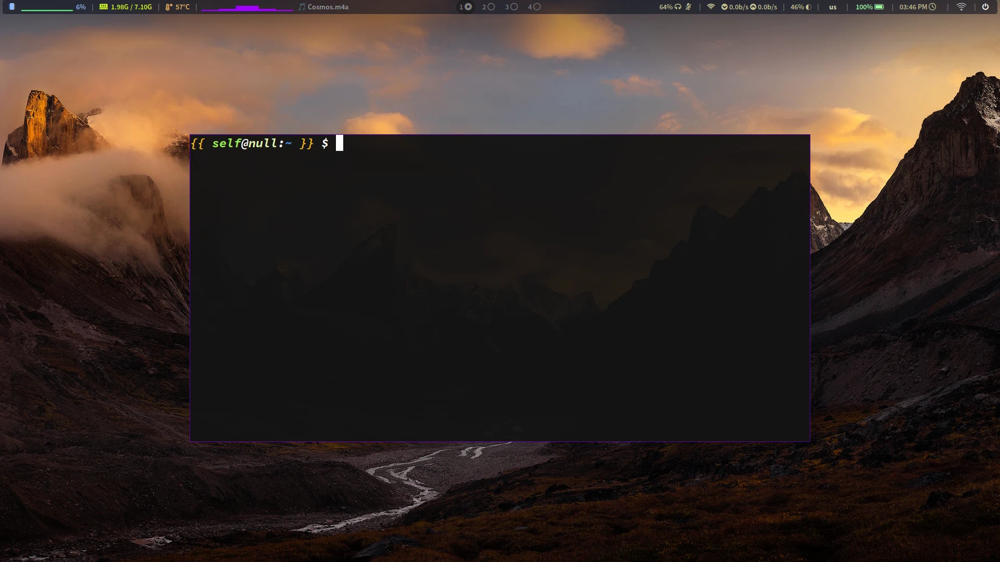

# Personal dotfiles

## migrated this repo to [nixos-dotfile](https://github.com/Rustlog/nixos-dotfile)

## This is my personal dotfile repo for the Linux setup.

## WM (Window manager - sway)

#### Core configuration (Main setup):
- **Scripts:** [Handy scripts (MountSSH, Dotsync, JournalToday and more)](scripts/)
- **Sway**: [~/.config/sway/config](sway/config)
- **Waybar**: [~/.config/sway/waybar](sway/waybar/)
- **Neovim**: [/etc/xdg/nvim/init.vim](neovim/init.vim)
- **Vim**: [/etc/vimrc](vim/vimrc)
- **Common shell config**: [ Shell config (bash and zsh) ](shell/shell_rc)
- **Foot**: [~/.config/foot/foot.ini](foot/foot.ini)
- **Wofi**: [~/.config/wofi](wofi/)
- **ArchSetup**: [Setup scripts for Arch Linux](ArchSetup/)
- **Yazi**: [~/.config/yazi](yazi/)

#### Others (Not used often)
- **i3**: [~/.config/i3/config](i3/config)
- **Hyperland**: [~/.config/hypr/hyprland.conf](hyprland/hyprland.conf)
- **Alacritty**: [~/.config/alacritty/alacritty.toml](alacritty/alacritty.toml)
- **Qutebrowser**: [~/.config/qutebrowser](qutebrowser/)
- **Kitty**: [~/.config/kitty/kitty.conf](kitty/kitty.conf)

### Notes
-  -> These dotfiles are for my own personal use, but feel free to borrow anything you like!
-  -> The [other](#others-not-used-often) section contain files I occasionally use or rarely use them.

